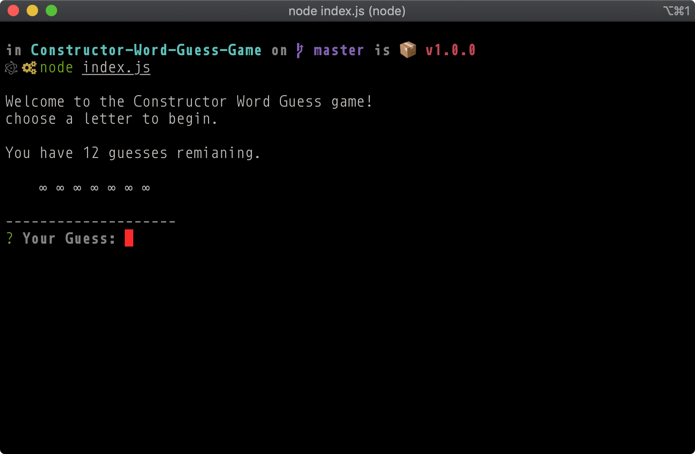
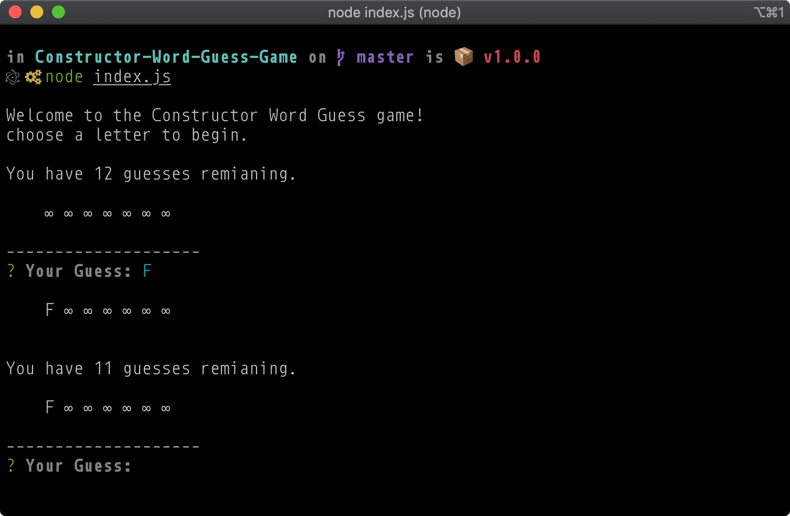
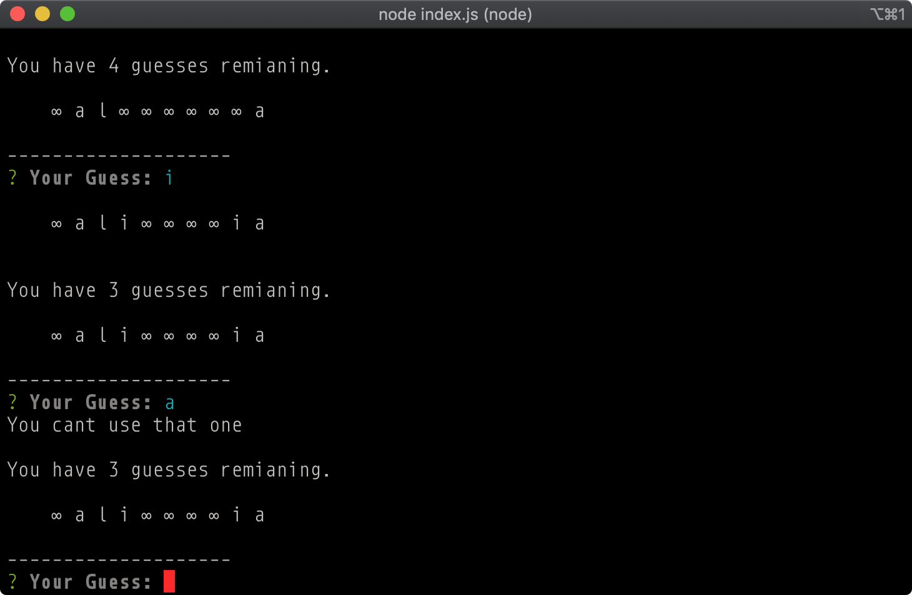
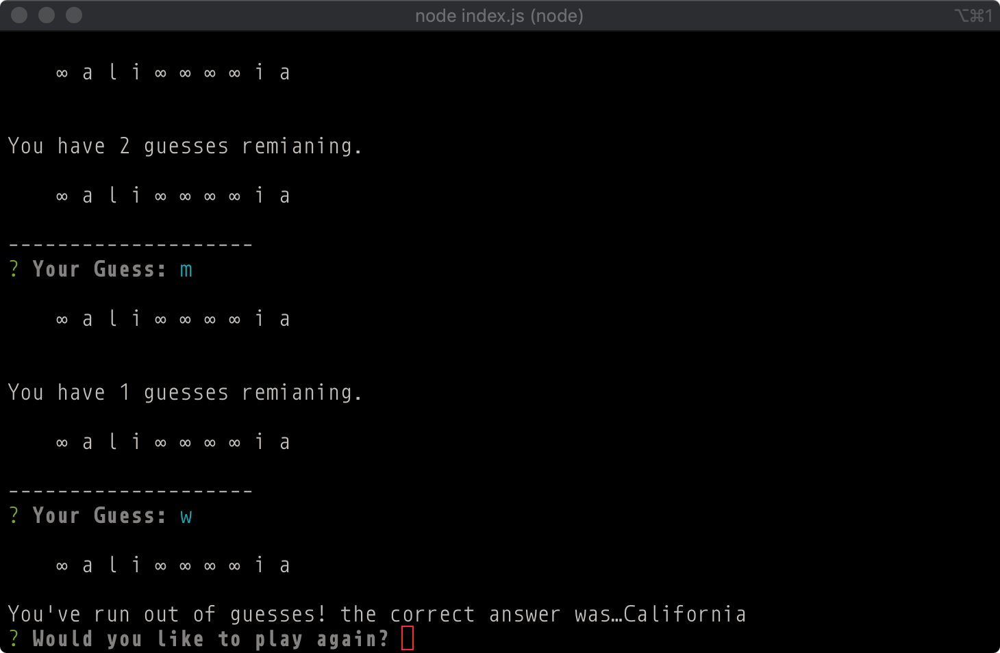
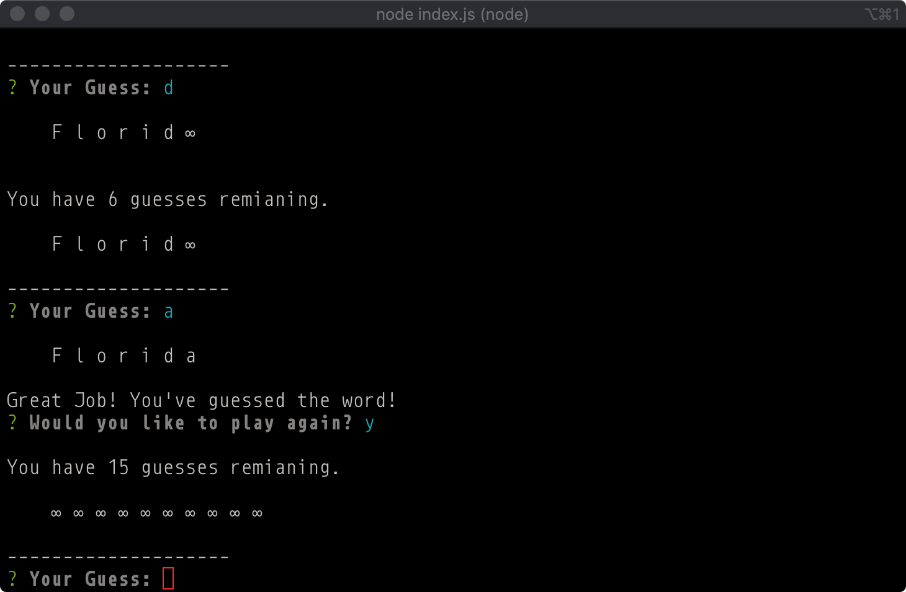

##### Advanced JavaScript Assignment: Constructor Word Guess

2021.10.29 - readme update

## Constructor Word Guess Game

Welcome to the Constructor Word Guess Game. This one is not that complicated and really not much a beauty, but it does utilize the inquirer npm package, and constructors.

This is a CLI application. 

The three files are created as described in the instructinos.md file.

- **Letter.js**: Contains a constructor that does a lot of the work, but is only called by the next file.

- **Word.js**: Contains a constructor that is called upon by the main game file. this constructor relies on Letter.js

* **index.js**: The file containing the logic for the game, depending heavily on Word.js. 

### ScreenShots

Starting the Game

Correct Guess

Wrong Guess

No More Guesses

Winning the Game
